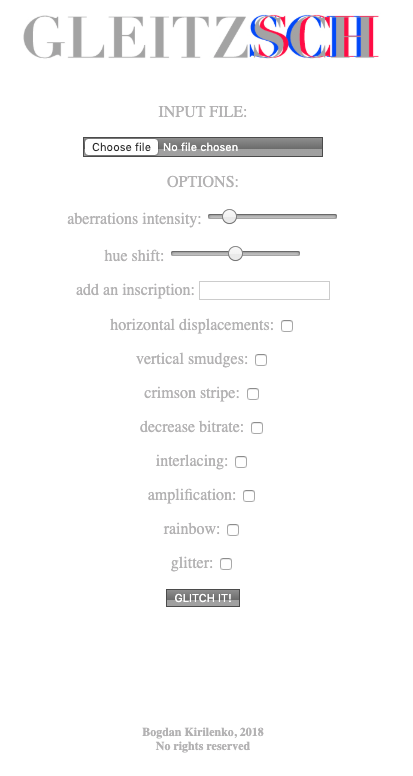
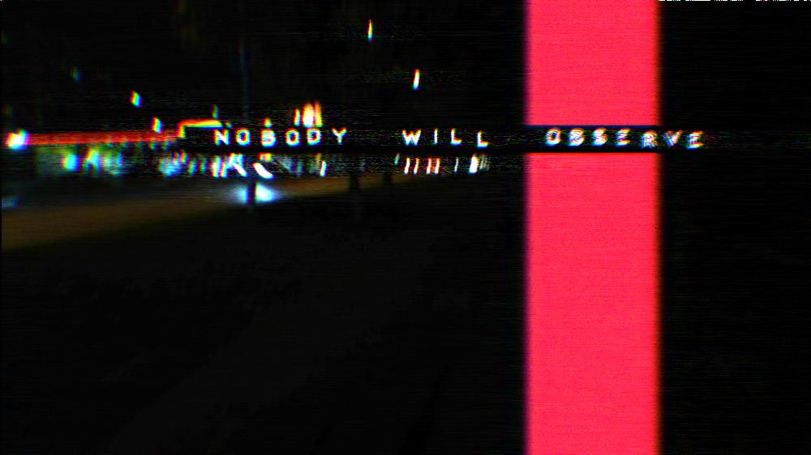
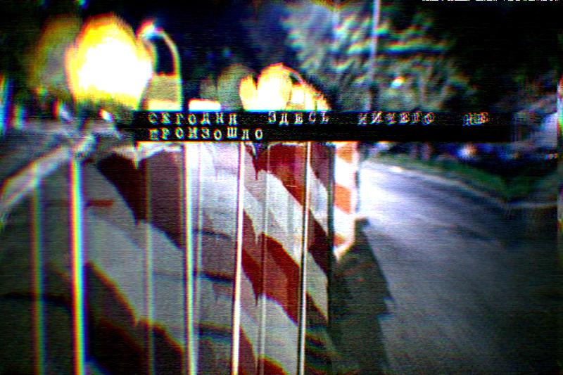
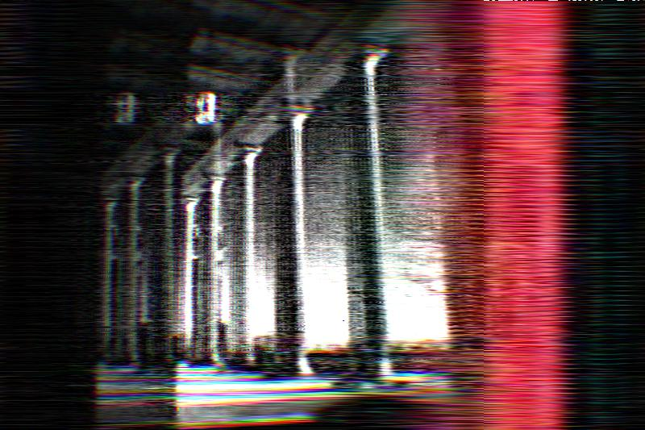
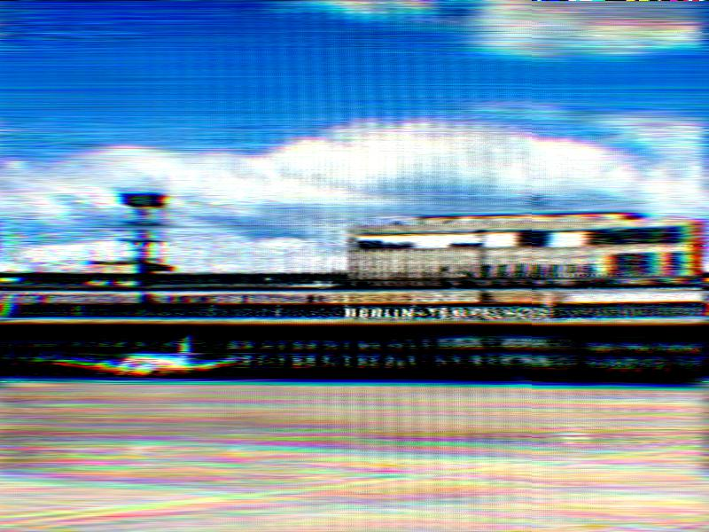

# Gleitzsch

A tool to generate glitch art.

According the Wikipedia the glitch art "is the practice of using digital or analog errors for aesthetic purposes by either corrupting digital data or physically manipulating electronic devices".
This particular tool compresses an image as mp3 sound file and decompresses it back into a glitched image.
During this process it also might apply a variety of different filters.

## Usage

To run the program you need:

- all python libraries listed in requirements.txt installed
- lame installed

Lime can be obtained at: <http://lame.sourceforge.net/>.

You can use it with both command line and web interfaces.

### Command-line interface

```txt
usage: gleitzsch.py [-h] [--size SIZE] [--temp_dir TEMP_DIR]
                    [--blue_red_shift BLUE_RED_SHIFT] [--shift SHIFT]
                    [--gamma GAMMA] [--bayer] [--amplify] [--figures]
                    [--right_pecrentile RIGHT_PECRENTILE]
                    [--left_pecrentile LEFT_PECRENTILE]
                    [--hue_shift HUE_SHIFT] [--text TEXT]
                    [--text_font TEXT_FONT] [--bytes] [--interlacing]
                    [--vertical] [--kHz KHZ] [--sound_quality SOUND_QUALITY]
                    [--stripes] [--bitrate BITRATE] [--rainbow]
                    [--glitch_sound] [--glitter] [--v_streaks] [--hor_shifts]
                    [--add_iterations ADD_ITERATIONS] [--keep_temp]
                    input output

positional arguments:
  input                 Input image.
  output                Output file.

optional arguments:
  -h, --help            show this help message and exit
  --size SIZE           Long dimension, 800 as default.
  --temp_dir TEMP_DIR   Directory to hold temp files.
  --blue_red_shift BLUE_RED_SHIFT, -b BLUE_RED_SHIFT
                        use red/blue shift
  --shift SHIFT         Horizontal shift correction, pixels.
  --gamma GAMMA, --gm GAMMA
                        Gamma correction before mp3-ing. 0.5 as default.
  --bayer               Apply Bayer filter.
  --amplify, -a         Apply amplify filter.
  --figures, -f         Draw random shapes.
  --right_pecrentile RIGHT_PECRENTILE, --rp RIGHT_PECRENTILE
                        Contrast stretching, right percentile, 90 as default.
                        Int in range [left percentile..100]
  --left_pecrentile LEFT_PECRENTILE, --lp LEFT_PECRENTILE
                        Contrast stretching, left percentile, 2 as default.
                        Int in range [0..right_percentile]
  --hue_shift HUE_SHIFT
                        Change colors throw HSV space.Float value from -1 to
                        1.
  --text TEXT           add some text
  --text_font TEXT_FONT
                        Text fond, emboss as default.
  --bytes               Glitch at the image bytes level.
  --interlacing, -i     Interlacing
  --vertical            Vertical lines.
  --kHz KHZ             Mp3 resampling. Recommended values are: 15.98, 15.99,
                        16.0 (default), 16.01
  --sound_quality SOUND_QUALITY, -q SOUND_QUALITY
                        Sound quality, 0..9
  --stripes, -s         stripes.
  --bitrate BITRATE     Mp3 bitrate.
  --rainbow, -r         Add rainbow.
  --glitch_sound, --gs  Distort the sound.
  --glitter, -g         Add some glitter.
  --v_streaks, -v       Add vertical streaks.
  --hor_shifts, --hs    Add horizontal.. hm....
  --add_iterations ADD_ITERATIONS, --ai ADD_ITERATIONS
                        Additional de/en-code cycles.
  --keep_temp           Do not remove temp files.
```

### Web interface

Just run:

```shell
./runserver.py
```

Then open <http://0.0.0.0:5000> in a browser.

Then something like this should appear:



Functionality of this version covers almost all options of the CLI.

## What is glitch








